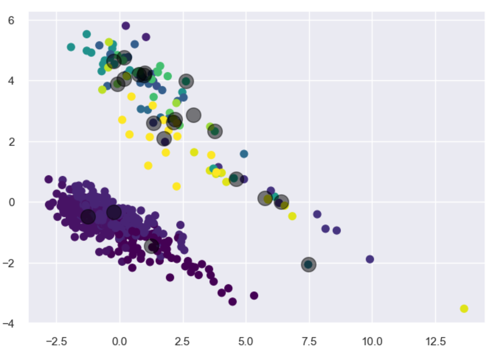
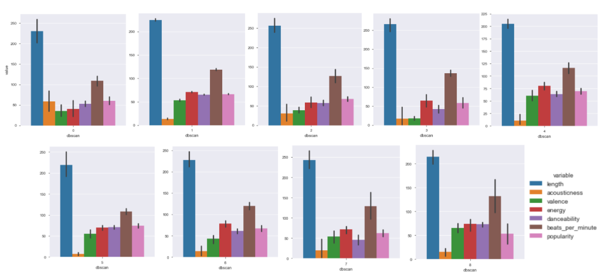
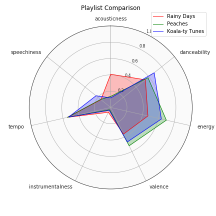
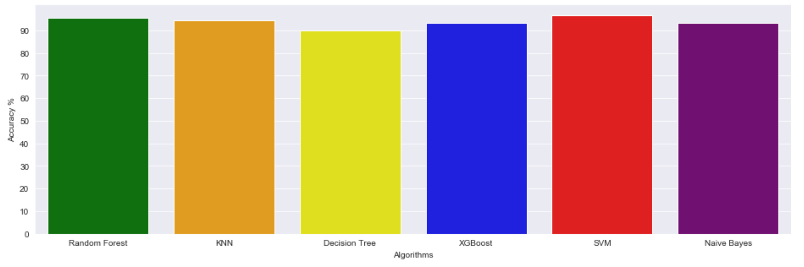

# Spotify-Music-Data-Analyses

## Background/Project Motivation  
Spotify is a digital music, podcast and video streaming service that has gained enormous popularity in recent years. It allows people to access millions of songs and other audio content from all over the world in one convenient service. 
  

## Data Sources  
The data used in these analyses was from two different sources:
  1. **Kaggle** - 'Top Spotify Songs from 2010-2019 by year' link: https://www.kaggle.com/leonardopena/top-spotify-songs-from-20102019-by-year
  
  2. **Spotify** - My personal playlists: "Koala-ty Tunes", "Peaches", and "Rainy Days" obtained using the Spotify API. The code script is found in Notebook 2. "Spotify API Data Gathering" 
  

## Table of Contents
This project is separated into three jupyter notebooks:

### 1. Top Spotify Songs 2010-2019 Data Analysis  
> **Business Understanding**  
> **Data Cleaning**  
        - Removing irregular null values  
        - Removing duplicates  
        - consolidating genres  
> **Exploratory Data Analysis**  
        - Matplotlib  
        - Seaborn  
        - Plotly  
> **Clustering Algorithms to make Ready-Made Playlists**  
        - PCA  
        - K Means Clustering  
            - Elbow Plot  
            - Dendrogram  
        - Agglomerative Clustering  
        - DBScan  
        - Silhouette Score  
> **Hypothesis Testing**  
        - Shapiro-Wilk Test  
        - Levene Test  
        - Welch's T-test  
        - Tukey Multiwise Comparison  
> **Multiple Linear Regression to predict what song would be popular in 2020**  
        - K-Fold Cross Validation  
        - Ridge Regression  
        - Lasso Regression  
        - GridSearchCV  
        - K Nearest Neighbors  
> **Future Work**  
 

### 2. Spotify API Gathering Data  
> - Defining functions to pull playlist data from my personal spotify account  
> - Manipulating the data into useful datasets containing the song features  
> - Visualizing the differences in the song features between playlists  
> - Exporting dataframes as excel .csv files  
 

### 3. My Spotify Mood
> **Clustering songs into my personal moods**  
        - K Means Clustering  
        - PCA  
        - t-SNE  
> **Machine Learning to Predict My Personal Mood Labels**  
        - Random Forest Classifier  
        - K Nearest Neighbors Classifier  
        - Decision Tree Classifier  
        - XGBoost  
        - Support Vector Model  
        - Naive Bayes  
        - MLP Classifier (Neural Network)  
 

## Technical Report 

### EDA
Using matplotlib and plotly we explored the relationships between the individual song features. Analysis included:
1. Profile Report of the Kaggle dataset  
2. Number of Tracks in each genre  
3. Number of songs by each artist  
4. Tracks by year  
5. Heatmap of correlations between continuous variables  
6. Pairplot to show distributions and relationships between features  
7. Lineplot of Acousticness vs. Energy of a track  
8. Swarmplot of Liveness vs. Loudness(dB)  
9. Boxplot Beats per minute by Year  
10. Swarmplot Danceability by Year  
11. kde plot Danceability vs. Popularity  
12. kde plot Valence vs. Danceability  
13. kde plot Valence vs. Popularity  
14. kde plot Speechiness vs. Length  
15. WordCloud of genres  
16. Barplot Top 20 Most Frequent Artists  
17. Barplot Top 20 Most Popular Tracks  
18. Lineplot showing Number of Tracks by each Artist Per Year for the top 10 artists  
19. Pie Plot of genres  
20. Plotly scatterplot showing the beats per minute and valence of each track every year from 2010-2019.   
21. Seaborn PairGrid of each continuous feature over the years to visualize trends over time  

### Clustering for Top Spotify Songs from 2010-2019 Dataset
We used three different clustering algorithms for our Top Popular Songs dataset.  
 
**K-Means** clustering is one of the most popular unsupervised machine learning techniques which groups similar data points together to discover underlying patterns. 
 
**DBScan** stands for Density-Based Spatial clustering of applications with noise and it groups together points that are close to each other based on a distance measurement (usually Euclidean distance) and a minimum number of points. It also marks as outliers the points that are in low-density regions. 
 
**Agglomerative Clustering** is a bottom-up hierarchal algorithm. Bottom-up algorithms treat each document as a singleton cluster at the outset and then successively merge (or agglomerate) pairs of clusters until all clusters have been merged into a single cluster that contains all documents. 
 
To determine the success of each clustering algorithm we used the silhouette score. Wikipedia describes the silhouette score as a measure of how similar an object is to its own cluster (cohesion) compared to other clusters (separation). The silhouette ranges from −1 to +1, where a high value indicates that the object is well matched to its own cluster and poorly matched to neighboring clusters. 

 

 
 

Each cluster label was its own playlist. By clustering songs with similar attributes together, we can get a better understanding of our users' music choice. If a user tends to have a preference for the 'signature sounds' of one cluster, we can recommend similar songs in order to keep the user engaged and improve their overall experience with our platform.  
 

### Hypothesis Testing for Top Spotify Songs from 2010-2019 Dataset
In order to gain and retain Spotify premium users, it is important to continually generate analytical insights to improve the listening experience of Spotify customers. We used statistical analysis and hypothesis testing to answer the following questions:
>**1. Does valence have a statistically significant effect on the popularity of a song?**    
>**2. Does danceability have a statistically significant effect on the popularity of a song? At what levels of danceability?**
 

For the first question, we broke it down into the following null hypothesis and alternative hypothesis:
 - H0: Valence has no effect on the popularity of a song.
 - H1: Valence does have an effect on the popularity of a song. 

For the second question, we broke it down into the following:
 - H0: Danceability has no effect on the popularity of a track.
 - H1: Danceability has a significant effect on the popularity of a track. 

**Conclusions:**
We found that neither valence or energy seemed to influence the popularity of a song.   
This may have to do with outside features that are not included in our data - such as the artist’s popularity or their social media presence, if the artist appeared in any major events (coachella, super bowl, grammy’s, etc), the influence of the record company of the artist, what age group is the majority of our listeners? More information is needed to determine an answer to our original question – What makes a song popular? These are things we may want to consider in order to better cater to our user base and also expand our user base. 

### Multiple Linear Regression to make a prediction for 2020 
We used multiple linear regression to determine what song features would be most popular for 2020. We compared the Root Mean Squared Error for multiple models and found that our K-fold Cross Validation MLR model performed the best with the smallest error value (0.1697).  

We found that the track features that would most popular in 2020 are features similar to the track 'Blah, Blah, Blah' by Kesha. 

### Data Gathering using Spotify API
I specified songs that were different moods so I could get a wide variety of song features.  

I transformed the data into a useable dataset that I saved into a .csv file for analysis in notebook 3.  

### Clustering using Personal Spotify Data
Music is a medium that conveys emotion or a mood. People usually listen to songs that align with the mood that they are feeling. Using Kmeans clustering, I classified my tracks into 3 distinct clusters based on the key emotions that I associate with the majority of songs in a particular cluster: Energetic, Chill, and Cheerful.  

For cross-validation, the cluster labeled dataset was split into training and testing validation sets. For each classifier, confusion matrices and accuracies were used to calculate the success. We also looked at the feature importances of the continuous variables we used in our model. Energy, Valence and Tempo were dropped from our features due to data leakage in our model.  

 

For cross-validation,the cluster labeled dataset was split into training and testing validation sets. For each classifier, confusion matrices and accuracies were used to calculate the success. 

**Confusion Matrices**
For a given classifier, a confusion matrix could be constructed. The confusion matrix is used to show the number of True positives (TP), True negatives (TN), False positives (FP), False negatives (FN). 
 
**Accuracy**
Accuracy determines out of all the classifications, how many did we classify correctly? This is represented as:   
Accuracy = (TP + TN) / (TP + TN + FP + FN)
 
### Business Recommendations:
- Create ready-made playlists based on the users' personal preferences. 
- Provide Song Recommendations that are similar to the users' current songs. 
- Create personal playlists catered to the users' mood. 

### Future Work:
- Time Series analyses to see what genres are growing in popularity. 
- Include Artist popularity ranking and social media presence in the data. 
- Create a neural network that would recommend songs and continually recommend relevant content as the users' taste changes over time.  

